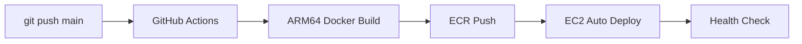

# SED分析API - 生活音集計サービス

音響イベント検出（SED）データから優先順位に基づいて生活音を抽出・集計するFastAPIベースのREST APIサービスです。健康モニタリングに重要な生体反応を優先的に表示し、日常生活の音を体系的に分類します。

## 🚨 重要: デプロイ方法について

**このAPIは完全自動CI/CDパイプラインで管理されています。**
- ✅ mainブランチへのpushで自動的に本番環境にデプロイ
- ✅ 手動デプロイは不要（GitHub Actions が全て処理）
- ⚠️ 詳細は [CI/CDパイプライン](#cicd-パイプライン) セクションを参照

## 📋 システム概要

### 🌐 主な機能
- **優先順位ベースの生活音抽出**: 健康モニタリングに重要な生体反応を最優先表示
- **音の自動統合**: 類似する音を自動的にグループ化して、より強い信号として検出
- **ノイズ除去**: 誤検出の多いイベントを自動除外
- **完全自動化**: CI/CDパイプラインによる自動デプロイ

### 🏗️ システム構成
- **データソース**: Supabase `behavior_yamnet` テーブル（AST音響分析結果）
- **データ処理**: 優先順位に基づく生活音の抽出と集計
- **データ保存**: Supabase `behavior_summary` テーブル
- **API提供**: FastAPIによるREST API（自動デプロイ対応）

## 📊 集計処理の仕様

### 処理フロー
1. **データ取得**: behavior_yamnetテーブルから指定device_id・日付のデータを取得
2. **イベント抽出**: 各time_block（30分スロット）のeventsからラベルを抽出  
3. **音の統合**: 類似する音を自動的にグループ化（水関連→「水の音」など）
4. **フィルタリング**: 除外リストに基づいてノイズイベントを除去
5. **優先順位判定**: 生体反応 → 声・会話 → 生活音 → その他の順で選別
6. **生活音リスト生成**: 最大10件を抽出（生体反応は必ず含める）
7. **日本語化**: 最後に日本語に翻訳して保存

### データ形式
- **新形式（AST）**: `{"time": 0.0, "events": [{"label": "Speech", "score": 0.85}, ...]}`
- **旧形式（YAMNet）**: `{"label": "Speech", "prob": 0.85}`

## 🎯 生活音の優先順位システム

### 優先順位に基づく表示
ダッシュボードには以下の優先順位で最大10件の生活音が表示されます：

1. **🔴 最優先: 生体反応（健康モニタリング）**
   - 咳、くしゃみ、鼻をすする音、呼吸音
   - いびき、ため息、しゃっくり、げっぷ、咀嚼音
   - **特徴**: 1回でも検出されれば必ず表示

2. **🗣️ 優先度2: 声・会話（社会活動の指標）**
   - 話し声、子供の声、会話、笑い声
   - 泣き声、歌声、電話の音
   - **特徴**: 出現回数の多い順に表示

3. **🏠 優先度3: 生活音（日常活動）**
   - 水の音、食器の音、ドア、足音
   - タイピング、家電の音（テレビ、掃除機等）
   - **特徴**: 出現回数の多い順に表示

4. **✨ その他**
   - 上記カテゴリ外の音（音楽など）
   - **特徴**: 残り枠に出現回数順で表示

## 🔧 音の統合マッピング

システムは類似する音を自動的に統合して、より強い信号として検出します：

- **水の音**: 蛇口、シンク、注ぐ音、水滴など水関連の音
- **タイピング**: キーボード、コンピュータ入力関連の音
- **動物**: ペット、家畜など動物関連の音
- **足音**: 歩行、走行など移動に関する音
- **ドア**: ドアベル、ノック、施錠音などドア関連の音
- **食器の音**: 皿、カトラリー、食器が触れ合う音
- **子供の声**: 子供の話し声、遊び声、叫び声
- **話し声**: スピーチ、会話、ナレーションなど
- **戸棚・引き出し**: 収納の開閉音

## 🚫 除外イベントリスト

以下のイベントは誤検出やノイズのため自動的に除外されます：

```python
EXCLUDED_EVENTS = [
    'Snake',       # ヘビ - 通常の生活環境では考えにくい
    'Insect',      # 昆虫 - 誤検出が多い
    'Cricket',     # コオロギ - 誤検出が多い
    'White noise', # ホワイトノイズ - 無意味な環境ノイズ
    'Mains hum',   # 電源ハム音 - 電気的ノイズ（50/60Hz）
    'Mouse',       # マウス - 誤検出が多いノイズ
    'Arrow',       # 矢 - 意味不明なイベント
]
```

### 除外の仕組み
- ✅ **生データ保存**: behavior_yamnetテーブルには全イベントが保存される
- ❌ **集計除外**: 生活音リストには含まれない
- ❌ **表示除外**: ダッシュボードには表示されない

## 🗄️ データベース構造

### behavior_yamnet テーブル（データソース）
```sql
CREATE TABLE behavior_yamnet (
  device_id     text NOT NULL,
  date          date NOT NULL,
  time_block    text NOT NULL,
  events        jsonb NOT NULL,
  PRIMARY KEY (device_id, date, time_block)
);
```

### behavior_summary テーブル（集計結果）
```sql
CREATE TABLE behavior_summary (
  device_id       text NOT NULL,
  date            date NOT NULL,
  summary_ranking jsonb NOT NULL,  -- 生活音リスト
  time_blocks     jsonb NOT NULL,  -- 時間別詳細
  PRIMARY KEY (device_id, date)
);
```

**summary_ranking（生活音リスト）の構造:**
```json
[
  {"event": "咳", "count": 2},
  {"event": "話し声", "count": 42},
  {"event": "水の音", "count": 15},
  {"event": "タイピング", "count": 10},
  {"event": "ドア", "count": 5}
]
```
（優先順位に基づき最大10件、生体反応は必ず含まれる）

## 🚀 CI/CD パイプライン

### デプロイフロー（完全自動化）



### 開発者がやること

```bash
# 1. コード修正
code sed_aggregator.py

# 2. コミット＆プッシュ（これだけ！）
git add .
git commit -m "feat: 新機能追加"
git push origin main

# 3. 自動デプロイ完了を待つ（約5分）
# GitHub Actions: https://github.com/hey-watchme/api-sed-aggregator/actions
```

## 🚨 CI/CD導入時の重要な注意点（必読）

### ⚠️ 2025年9月27日のインシデントから学んだ教訓

CI/CDパイプライン導入時に環境変数エラーが発生し、APIが「Invalid API key」で失敗しました。
以下の点を必ず確認してください。

### 📋 CI/CD導入チェックリスト

#### 1. **ECRリポジトリ名の統一** 🔴 最重要
```yaml
# ❌ 間違い：異なる名前を使用
# deploy-ecr.sh: watchme-api-behavior-aggregator
# docker-compose.prod.yml: watchme-api-sed-aggregator

# ✅ 正解：統一された名前を使用
ECR_REPOSITORY="watchme-api-behavior-aggregator"  # deploy-ecr.sh
image: 754724220380.dkr.ecr.ap-southeast-2.amazonaws.com/watchme-api-behavior-aggregator:latest  # docker-compose.prod.yml
```

**なぜ失敗したか**: 開発者がECRリポジトリ名を統一せず、異なる名前を使用したため、正しいイメージがプルされなかった。

#### 2. **環境変数ファイル（.env）の配置** 🔴 最重要
```bash
# EC2サーバー上に.envファイルが必要
/home/ubuntu/api-sed-aggregator/
├── docker-compose.prod.yml
├── .env  # ← これが必須！
```

**デプロイ前に必ず実行**:
```bash
# .envファイルをEC2にコピー
scp -i ~/watchme-key.pem .env ubuntu@3.24.16.82:/home/ubuntu/api-sed-aggregator/.env
```

**なぜ失敗したか**: CI/CDでDockerイメージは更新されたが、.envファイルがEC2サーバーに配置されていなかった。

#### 3. **docker-compose.prod.ymlの同期** 
```bash
# ローカルで変更した後、必ずEC2にコピー
scp -i ~/watchme-key.pem docker-compose.prod.yml ubuntu@3.24.16.82:/home/ubuntu/api-sed-aggregator/
```

**なぜ失敗したか**: ローカルのdocker-compose.prod.ymlとEC2上のファイルが同期されていなかった。

### 🔧 正しいデプロイ手順

#### 手動デプロイ（推奨）
```bash
# 1. ECRイメージをビルド＆プッシュ
./deploy-ecr.sh

# 2. 設定ファイルと環境変数をEC2に配置
./deploy-to-ec2.sh  # このスクリプトが.envとdocker-compose.prod.ymlを配置

# 3. 動作確認
curl -s https://api.hey-watch.me/behavior-aggregator/health | jq '.'
```

#### GitHub Actions CI/CD（将来実装時の注意）
```yaml
# .github/workflows/deploy.yml に含めるべき重要なステップ
- name: Deploy to EC2
  run: |
    # 1. .envファイルをシークレットから生成
    echo "SUPABASE_URL=${{ secrets.SUPABASE_URL }}" > .env
    echo "SUPABASE_KEY=${{ secrets.SUPABASE_KEY }}" >> .env
    
    # 2. EC2にファイルをコピー
    scp .env ubuntu@$EC2_HOST:/path/to/api/
    scp docker-compose.prod.yml ubuntu@$EC2_HOST:/path/to/api/
    
    # 3. コンテナ再起動
    ssh ubuntu@$EC2_HOST "cd /path/to/api && docker-compose -f docker-compose.prod.yml down && docker-compose -f docker-compose.prod.yml up -d"
```

### 🐛 トラブルシューティング

#### 症状：「Invalid API key」エラー
```bash
# 1. コンテナ内の環境変数を確認
ssh ubuntu@3.24.16.82 "docker exec api-sed-aggregator env | grep SUPABASE"

# 2. .envファイルの存在確認
ssh ubuntu@3.24.16.82 "ls -la /home/ubuntu/api-sed-aggregator/.env"

# 3. コンテナログ確認
ssh ubuntu@3.24.16.82 "docker logs api-sed-aggregator | tail -50"
```

#### 症状：コンテナが起動しない
```bash
# 既存コンテナを停止・削除
docker stop api-sed-aggregator && docker rm api-sed-aggregator

# 最新イメージをプル
docker pull 754724220380.dkr.ecr.ap-southeast-2.amazonaws.com/watchme-api-behavior-aggregator:latest

# 再起動
docker-compose -f docker-compose.prod.yml up -d
```

### 📝 他のAPIとの整合性確認

同じCI/CDプロセスを使用している他のAPIと設定を比較：
- `/api_gen-prompt_mood-chart_v1` - Vibe Aggregator API
- `/api_emotion-aggregator_v1` - Emotion Aggregator API

これらのAPIの`deploy-ecr.sh`と`docker-compose.prod.yml`を参考にしてください。

## 🚢 本番環境情報

- **サーバー**: AWS EC2 (3.24.16.82)
- **ECRリポジトリ**: `754724220380.dkr.ecr.ap-southeast-2.amazonaws.com/watchme-api-behavior-aggregator`
- **コンテナ名**: `api-sed-aggregator`
- **ポート**: 8010
- **本番 API URL**: https://api.hey-watch.me/behavior-aggregator/
- **APIドキュメント**: https://api.hey-watch.me/behavior-aggregator/docs

## 🌐 API エンドポイント

### 1. 分析開始 `POST /analysis/sed`
**機能**: データ取得・集計・保存をバックグラウンドで実行

```bash
POST /analysis/sed
{
  "device_id": "d067d407-cf73-4174-a9c1-d91fb60d64d0",
  "date": "2025-07-07"
}
```

### 2. 分析状況確認 `GET /analysis/sed/{task_id}`
**機能**: タスクの進捗状況と結果を取得

### 3. 全タスク一覧 `GET /analysis/sed`
**機能**: 実行中・完了済みの全タスクを一覧表示

### 4. タスク削除 `DELETE /analysis/sed/{task_id}`
**機能**: 完了・失敗したタスクを削除

### 5. ヘルスチェック `GET /health`
**機能**: API稼働状況の確認

## 📋 セットアップ

### 環境変数設定
`.env`ファイルを作成：
```env
SUPABASE_URL=https://qvtlwotzuzbavrzqhyvt.supabase.co
SUPABASE_KEY=your-supabase-key
```

### ローカル開発
```bash
# 依存関係インストール
pip install -r requirements.txt

# サーバー起動
python api_server.py
```

## 🔧 技術仕様

### パフォーマンス
- **同時処理**: バックグラウンドタスクによる非同期処理
- **データベース効率**: 単一クエリでの一括取得
- **メモリ効率**: ストリーミング処理

### エラーハンドリング
- Supabase接続エラーの自動検出
- データ不整合の自動処理
- 詳細なログ出力

## 📞 サポート

**API仕様の詳細**: Swagger UI
- 本番環境: `https://api.hey-watch.me/behavior-aggregator/docs`
- 開発環境: `http://localhost:8010/docs`