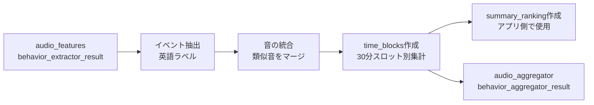

# Behavior Aggregator API | SED集計API - 音響イベント分析サービス

音響イベント検出（SED: Sound Event Detection）データを収集・分析し、優先順位に基づいて重要なイベントを抽出するFastAPIベースのREST APIサービスです。

---

## 🗺️ ルーティング詳細

| 項目 | 値 | 説明 |
|------|-----|------|
| **🏷️ サービス名** | Behavior Aggregator API | 音響イベント集計・分析 |
| **📊 役割** | SED集計 | Behavior Featuresの出力を集計 |
| | | |
| **🌐 外部アクセス（Nginx）** | | |
| └ 公開エンドポイント | `https://api.hey-watch.me/behavior-aggregator/` | 外部からのアクセスパス |
| └ Nginx設定ファイル | `/etc/nginx/sites-available/api.hey-watch.me` | 54-70行目 |
| └ proxy_pass先 | `http://localhost:8010/` | 内部転送先 |
| └ タイムアウト | デフォルト（60秒） | |
| | | |
| **🔌 API内部エンドポイント** | | |
| └ 分析開始 | `/analysis/sed` | POST - 非同期処理開始 |
| └ タスク確認 | `/analysis/sed/{task_id}` | GET - 進捗確認 |
| └ タスク一覧 | `/analysis/sed` | GET - 全タスク取得 |
| └ タスク削除 | `/analysis/sed/{task_id}` | DELETE |
| └ ヘルスチェック | `/health` | GET |
| | | |
| **🐳 Docker/コンテナ** | | |
| └ コンテナ名 | `api-sed-aggregator` | ※名前が不統一 |
| └ ポート（内部） | 8010 | コンテナ内 |
| └ ポート（公開） | `127.0.0.1:8010:8010` | ローカルホストのみ |
| └ ヘルスチェック | `/health` | Docker healthcheck |
| | | |
| **☁️ AWS ECR** | | |
| └ リポジトリ名 | `watchme-api-sed-aggregator` | |
| └ リージョン | ap-southeast-2 (Sydney) | |
| └ URI | `754724220380.dkr.ecr.ap-southeast-2.amazonaws.com/watchme-api-sed-aggregator:latest` | |
| | | |
| **⚙️ systemd** | | |
| └ サービス名 | `api-sed-aggregator.service` | ※名前が不統一 |
| └ 起動コマンド | `docker-compose up -d` | |
| └ 自動起動 | enabled | サーバー再起動時に自動起動 |
| | | |
| **📂 ディレクトリ** | | |
| └ ソースコード | `/Users/kaya.matsumoto/projects/watchme/api/behavior-analysis/aggregator` | ローカル |
| └ GitHubリポジトリ | `hey-watchme/api-behavior-analysis-aggregator` | |
| └ EC2配置場所 | `/home/ubuntu/api-sed-aggregator` | ※Docker経由が推奨 |
| | | |
| **🔗 呼び出し元** | | |
| └ Lambda関数 | `watchme-audio-worker` | Behavior Features成功時に自動起動 |
| └ 呼び出しURL | `https://api.hey-watch.me/behavior-aggregator/analysis/sed` | フルパス |
| └ 環境変数 | `API_BASE_URL=https://api.hey-watch.me` | Lambda内 |
| | | |
| **📥 データソース** | | |
| └ 入力テーブル | `audio_features.behavior_extractor_result` | Behavior Featuresの出力 |
| └ 出力テーブル | `audio_aggregator.behavior_aggregator_result` | 集計結果（time_blocks） |

---

## 🎯 主な特徴

- **柔軟な優先順位システム**: 健康モニタリングに重要な生体反応（咳、くしゃみ等）を自動的に優先表示
- **インテリジェントな音の統合**: 類似する音響イベントを自動的にグループ化（例：Water tap → Water sounds）
- **多言語対応**: 英語ラベルで処理し、最終段階で日本語翻訳を適用（国際化対応）
- **ノイズフィルタリング**: コンテキストに応じた動的な除外リスト
- **完全自動デプロイ**: GitHub Actions CI/CDパイプライン対応

## 📊 システムアーキテクチャ

### データフロー



### 処理パイプライン

1. **データ取得**: `audio_features.behavior_extractor_result`から音響イベントデータを取得
2. **イベント統合**: 類似する音響イベントを英語のままグループ化
3. **time_blocks生成**: 30分スロット別の集計データを作成
4. **summary_ranking生成**: 1日全体のランキング（アプリ側で計算可能、DBには保存しない）
5. **データ保存**: `audio_aggregator.behavior_aggregator_result`にtime_blocksを保存

## 🗄️ データベース構造

### 入力: audio_features テーブル

```sql
CREATE TABLE audio_features (
    device_id     TEXT NOT NULL,
    date          DATE NOT NULL,
    time_block    TEXT NOT NULL,  -- 30分単位のスロット (例: "15-00", "15-30")

    -- Behavior Extractor (SED)
    behavior_extractor_result JSONB,  -- 音響イベントのJSON配列
    behavior_extractor_status TEXT DEFAULT 'pending',
    behavior_extractor_processed_at TIMESTAMP WITH TIME ZONE,

    PRIMARY KEY (device_id, date, time_block)
);
```

**behavior_extractor_resultフィールドの形式（AST形式）:**
```json
[
    {
        "time": 0.0,
        "events": [
            {"label": "Speech", "score": 0.85},
            {"label": "Cough", "score": 0.65}
        ]
    }
]
```

### 出力: audio_aggregator テーブル

```sql
CREATE TABLE audio_aggregator (
    device_id       TEXT NOT NULL,
    date            DATE NOT NULL,

    -- Behavior Aggregator
    behavior_aggregator_result JSONB,  -- time_blocks（30分スロット別集計）
    behavior_aggregator_processed_at TIMESTAMP WITH TIME ZONE,

    PRIMARY KEY (device_id, date)  -- 1日1レコード
);
```

**重要**: `summary_ranking`はDBに保存せず、アプリ側で`time_blocks`から計算します。

**summary_rankingフィールドの形式:**
```json
[
    {
        "event": "話し声",
        "count": 42,
        "category": "voice",
        "priority": true
    },
    {
        "event": "水の音",
        "count": 15,
        "category": "other",
        "priority": false
    }
]
```

## 🎭 イベント処理システム

### 1. 音の統合マッピング

類似する音響イベントを統合して、より意味のあるカテゴリにグループ化します：

| 元のラベル | 統合後 |
|----------|--------|
| Water tap, faucet / Sink / Pour / Drip | Water sounds |
| Computer keyboard / Typing (computer) | Typing |
| Walk, footsteps / Running / Shuffle | Footsteps |
| Doorbell / Door knocker / Door lock | Door |
| Speech / Conversation / Narration | Speech |
| Child speech / Children shouting / Children playing | Child speech |

### 2. 優先カテゴリシステム

以下の3つのカテゴリに分類し、重要度に応じて優先表示：

#### 🔴 最優先: 生体反応（健康モニタリング）
- **検出条件**: 1回でも検出されれば必ず表示
- **対象**: Cough, Sneeze, Sniff, Snoring, Breathing, Hiccup, など
- **用途**: 健康状態の変化を即座に把握

#### 🟡 優先度2: 声・会話（社会活動）
- **検出条件**: 検出されたら優先表示
- **対象**: Speech, Child speech, Conversation, Laughter, など
- **用途**: コミュニケーション活動の把握

#### 🟢 優先度3: 生活音（日常活動）
- **検出条件**: 優先イベント以外で出現回数が多いもの
- **対象**: Water sounds, Dishes, Footsteps, Typing, など
- **用途**: 日常生活パターンの理解

### 3. 動的除外システム

コンテキストに応じて調整可能な除外リスト：

```python
# デフォルトの除外イベント
EXCLUDED_EVENTS = [
    'Snake',        # 通常の生活環境では考えにくい
    'Insect',       # 誤検出が多い
    'Cricket',      # 誤検出が多い
    'White noise',  # 無意味な環境ノイズ
    'Mains hum',    # 電源ハムノイズ
]
```

**注**: 将来的にはコンテキスト（場所・時間帯）に応じて動的に変更可能

## 🌐 API エンドポイント

### POST /analysis/sed
SED分析を開始（非同期処理）

**リクエスト:**
```json
{
    "device_id": "d067d407-cf73-4174-a9c1-d91fb60d64d0",
    "date": "2025-09-27",
    "translate": true  // オプション: 日本語翻訳の有無（デフォルト: true）
}
```

**レスポンス:**
```json
{
    "task_id": "abc123...",
    "status": "started",
    "message": "分析を開始しました"
}
```

### GET /analysis/sed/{task_id}
タスクの進捗状況を確認

**レスポンス:**
```json
{
    "task_id": "abc123...",
    "status": "completed",
    "message": "分析完了",
    "progress": 100,
    "result": {
        "summary_ranking": [...],
        "time_blocks": {...}
    }
}
```

### GET /analysis/sed
全タスクの一覧を取得

### DELETE /analysis/sed/{task_id}
完了したタスクを削除

### GET /health
APIの稼働状況を確認

## 🚀 セットアップ

### 1. 環境変数の設定

> **重要**: 本番環境ではGitHub Actionsが自動的に`.env`ファイルを作成します。
> 詳細は[CI/CD標準仕様書](../../server-configs/CICD_STANDARD_SPECIFICATION.md)を参照してください。

ローカル開発用の`.env`ファイル作成：

```env
SUPABASE_URL=https://your-project.supabase.co
SUPABASE_KEY=your-supabase-anon-key
```

### 2. 依存関係のインストール

```bash
pip install -r requirements.txt
```

### 3. ローカル開発

```bash
# APIサーバーの起動
python api_server.py

# または、uvicornで直接起動
uvicorn api_server:app --reload --port 8010
```

### 4. APIドキュメントの確認

- 開発環境: http://localhost:8010/docs
- 本番環境: https://api.hey-watch.me/behavior-aggregator/docs

## 🧪 テスト

### 単体テスト

```bash
# 集計処理のテスト（日本語/英語両方）
python test_aggregator.py

# データベース保存結果の確認
python check_db_result.py
```

### API統合テスト

```bash
# APIエンドポイントのテスト
curl -X POST http://localhost:8010/analysis/sed \
  -H "Content-Type: application/json" \
  -d '{
    "device_id": "d067d407-cf73-4174-a9c1-d91fb60d64d0",
    "date": "2025-09-27",
    "translate": true
  }'
```

## 🚢 デプロイ

### 自動デプロイ（CI/CD）

> **📘 詳細**: [CI/CD標準仕様書](../../server-configs/CICD_STANDARD_SPECIFICATION.md)を参照

mainブランチへのプッシュで自動的にデプロイ：

```bash
git add .
git commit -m "feat: 新機能の追加"
git push origin main
```

**CI/CDプロセス**:
1. GitHub ActionsがECRにDockerイメージをプッシュ
2. GitHub Secretsから環境変数を取得してEC2に`.env`ファイルを作成
3. Docker Composeでコンテナを再起動

### 必要なGitHub Secrets設定

```
AWS_ACCESS_KEY_ID       # AWS認証
AWS_SECRET_ACCESS_KEY   # AWS認証  
EC2_HOST                # デプロイ先EC2
EC2_SSH_PRIVATE_KEY     # SSH接続用
EC2_USER                # SSHユーザー
SUPABASE_URL            # Supabase URL（重要）
SUPABASE_KEY            # Supabase APIキー（重要）
```

### 手動デプロイ（非推奨）

CI/CDを使用せずに手動でデプロイする場合のみ：

```bash
# ECRへのイメージプッシュ
./deploy-ecr.sh

# EC2で実行
ssh -i ~/watchme-key.pem ubuntu@3.24.16.82
cd /home/ubuntu/api-sed-aggregator
./run-prod.sh
```

## 📋 トラブルシューティング

### よくある問題と解決方法

#### 1. 空の summary_ranking が返される

**原因**: イベントが除外リストに含まれている、または優先カテゴリにマッチしない

**解決方法**:
```python
# デバッグモードで実行
python test_aggregator.py  # 詳細なログを確認
```

#### 2. 日本語が文字化けする

**原因**: 翻訳フラグが正しく設定されていない

**解決方法**:
```json
// APIリクエストで translate: true を明示的に指定
{
    "device_id": "...",
    "date": "...",
    "translate": true
}
```

#### 3. Supabase接続エラー（Invalid API key）

**原因**: 環境変数が正しく設定されていない

**解決方法**:

1. GitHub Secretsを確認:
   - `SUPABASE_URL`と`SUPABASE_KEY`が設定されているか確認

2. EC2で環境変数を確認:
   ```bash
   cd /home/ubuntu/api-sed-aggregator
   cat .env
   # SUPABASE_URL と SUPABASE_KEY が正しいか確認
   ```

3. コンテナ内の環境変数を確認:
   ```bash
   docker exec api-sed-aggregator env | grep SUPABASE
   ```

詳細は[CI/CD標準仕様書](../../server-configs/CICD_STANDARD_SPECIFICATION.md)を参照

## 📈 パフォーマンス最適化

- **バッチ処理**: 複数の time_block を一度に処理
- **非同期実行**: FastAPIのバックグラウンドタスクで並列処理
- **データベース最適化**: 単一クエリで効率的なデータ取得

## 🔒 セキュリティ

- 環境変数による認証情報の管理
- Supabaseの行レベルセキュリティ（RLS）対応
- APIレート制限（本番環境）

## 📝 今後の拡張予定

1. **コンテキスト対応**: 場所・時間帯に応じた動的な優先度調整
2. **AIモデル切り替え**: 複数の音響認識モデル対応
3. **リアルタイム処理**: WebSocketによるストリーミング処理
4. **多言語対応**: 英語以外の言語への翻訳対応
5. **異常検知**: 通常パターンからの逸脱を自動検出

## 📞 サポート

- **GitHub Issues**: [問題報告](https://github.com/hey-watchme/api-sed-aggregator/issues)
- **API仕様書**: Swagger UI でインタラクティブに確認可能
- **ログ確認**: CloudWatch Logs（本番環境）

## 📄 ライセンス

Proprietary - All rights reserved

---

最終更新日: 2025年1月