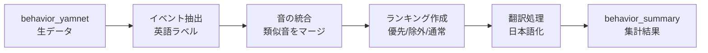

# SED集計API - 音響イベント分析サービス

音響イベント検出（SED: Sound Event Detection）データを収集・分析し、優先順位に基づいて重要なイベントを抽出するFastAPIベースのREST APIサービスです。

## 🎯 主な特徴

- **柔軟な優先順位システム**: 健康モニタリングに重要な生体反応（咳、くしゃみ等）を自動的に優先表示
- **インテリジェントな音の統合**: 類似する音響イベントを自動的にグループ化（例：Water tap → Water sounds）
- **多言語対応**: 英語ラベルで処理し、最終段階で日本語翻訳を適用（国際化対応）
- **ノイズフィルタリング**: コンテキストに応じた動的な除外リスト
- **完全自動デプロイ**: GitHub Actions CI/CDパイプライン対応

## 📊 システムアーキテクチャ

### データフロー



### 処理パイプライン

1. **データ取得**: `behavior_yamnet`テーブルから音響イベントデータを取得
2. **イベント統合**: 類似する音響イベントを英語のままグループ化
3. **ランキング生成**: 優先カテゴリ抽出 → 除外フィルタ → 通常ランキング
4. **翻訳適用**: API応答時に日本語翻訳を適用（オプション）
5. **データ保存**: `behavior_summary`テーブルに全データを保存

## 🗄️ データベース構造

### 入力: behavior_yamnet テーブル

```sql
CREATE TABLE behavior_yamnet (
    device_id     text NOT NULL,
    date          date NOT NULL,
    time_block    text NOT NULL,  -- 30分単位のスロット (例: "15-00", "15-30")
    events        jsonb NOT NULL,  -- 音響イベントのJSON配列
    PRIMARY KEY (device_id, date, time_block)
);
```

**eventsフィールドの形式（AST形式）:**
```json
[
    {
        "time": 0.0,
        "events": [
            {"label": "Speech", "score": 0.85},
            {"label": "Cough", "score": 0.65}
        ]
    }
]
```

### 出力: behavior_summary テーブル

```sql
CREATE TABLE behavior_summary (
    device_id       text NOT NULL,
    date            date NOT NULL,
    summary_ranking jsonb NOT NULL,  -- 優先イベント＋ランキング（全データ）
    time_blocks     jsonb NOT NULL,  -- 時間帯別の詳細データ
    PRIMARY KEY (device_id, date)
);
```

**summary_rankingフィールドの形式:**
```json
[
    {
        "event": "話し声",
        "count": 42,
        "category": "voice",
        "priority": true
    },
    {
        "event": "水の音",
        "count": 15,
        "category": "other",
        "priority": false
    }
]
```

## 🎭 イベント処理システム

### 1. 音の統合マッピング

類似する音響イベントを統合して、より意味のあるカテゴリにグループ化します：

| 元のラベル | 統合後 |
|----------|--------|
| Water tap, faucet / Sink / Pour / Drip | Water sounds |
| Computer keyboard / Typing (computer) | Typing |
| Walk, footsteps / Running / Shuffle | Footsteps |
| Doorbell / Door knocker / Door lock | Door |
| Speech / Conversation / Narration | Speech |
| Child speech / Children shouting / Children playing | Child speech |

### 2. 優先カテゴリシステム

以下の3つのカテゴリに分類し、重要度に応じて優先表示：

#### 🔴 最優先: 生体反応（健康モニタリング）
- **検出条件**: 1回でも検出されれば必ず表示
- **対象**: Cough, Sneeze, Sniff, Snoring, Breathing, Hiccup, など
- **用途**: 健康状態の変化を即座に把握

#### 🟡 優先度2: 声・会話（社会活動）
- **検出条件**: 検出されたら優先表示
- **対象**: Speech, Child speech, Conversation, Laughter, など
- **用途**: コミュニケーション活動の把握

#### 🟢 優先度3: 生活音（日常活動）
- **検出条件**: 優先イベント以外で出現回数が多いもの
- **対象**: Water sounds, Dishes, Footsteps, Typing, など
- **用途**: 日常生活パターンの理解

### 3. 動的除外システム

コンテキストに応じて調整可能な除外リスト：

```python
# デフォルトの除外イベント
EXCLUDED_EVENTS = [
    'Snake',        # 通常の生活環境では考えにくい
    'Insect',       # 誤検出が多い
    'Cricket',      # 誤検出が多い
    'White noise',  # 無意味な環境ノイズ
    'Mains hum',    # 電源ハムノイズ
]
```

**注**: 将来的にはコンテキスト（場所・時間帯）に応じて動的に変更可能

## 🌐 API エンドポイント

### POST /analysis/sed
SED分析を開始（非同期処理）

**リクエスト:**
```json
{
    "device_id": "d067d407-cf73-4174-a9c1-d91fb60d64d0",
    "date": "2025-09-27",
    "translate": true  // オプション: 日本語翻訳の有無（デフォルト: true）
}
```

**レスポンス:**
```json
{
    "task_id": "abc123...",
    "status": "started",
    "message": "分析を開始しました"
}
```

### GET /analysis/sed/{task_id}
タスクの進捗状況を確認

**レスポンス:**
```json
{
    "task_id": "abc123...",
    "status": "completed",
    "message": "分析完了",
    "progress": 100,
    "result": {
        "summary_ranking": [...],
        "time_blocks": {...}
    }
}
```

### GET /analysis/sed
全タスクの一覧を取得

### DELETE /analysis/sed/{task_id}
完了したタスクを削除

### GET /health
APIの稼働状況を確認

## 🚀 セットアップ

### 1. 環境変数の設定

`.env`ファイルを作成：

```env
SUPABASE_URL=https://your-project.supabase.co
SUPABASE_KEY=your-supabase-anon-key
```

### 2. 依存関係のインストール

```bash
pip install -r requirements.txt
```

### 3. ローカル開発

```bash
# APIサーバーの起動
python api_server.py

# または、uvicornで直接起動
uvicorn api_server:app --reload --port 8010
```

### 4. APIドキュメントの確認

- 開発環境: http://localhost:8010/docs
- 本番環境: https://api.hey-watch.me/behavior-aggregator/docs

## 🧪 テスト

### 単体テスト

```bash
# 集計処理のテスト（日本語/英語両方）
python test_aggregator.py

# データベース保存結果の確認
python check_db_result.py
```

### API統合テスト

```bash
# APIエンドポイントのテスト
curl -X POST http://localhost:8010/analysis/sed \
  -H "Content-Type: application/json" \
  -d '{
    "device_id": "d067d407-cf73-4174-a9c1-d91fb60d64d0",
    "date": "2025-09-27",
    "translate": true
  }'
```

## 🚢 デプロイ

### 自動デプロイ（CI/CD）

mainブランチへのプッシュで自動的にデプロイ：

```bash
git add .
git commit -m "feat: 新機能の追加"
git push origin main
```

### 手動デプロイ

```bash
# ECRへのイメージプッシュ
./deploy-ecr.sh

# EC2への設定ファイル転送とデプロイ
./deploy-to-ec2.sh
```

## 📋 トラブルシューティング

### よくある問題と解決方法

#### 1. 空の summary_ranking が返される

**原因**: イベントが除外リストに含まれている、または優先カテゴリにマッチしない

**解決方法**:
```python
# デバッグモードで実行
python test_aggregator.py  # 詳細なログを確認
```

#### 2. 日本語が文字化けする

**原因**: 翻訳フラグが正しく設定されていない

**解決方法**:
```json
// APIリクエストで translate: true を明示的に指定
{
    "device_id": "...",
    "date": "...",
    "translate": true
}
```

#### 3. Supabase接続エラー

**原因**: 環境変数が正しく設定されていない

**解決方法**:
```bash
# 環境変数を確認
cat .env
# SUPABASE_URL と SUPABASE_KEY が正しいか確認
```

## 📈 パフォーマンス最適化

- **バッチ処理**: 複数の time_block を一度に処理
- **非同期実行**: FastAPIのバックグラウンドタスクで並列処理
- **データベース最適化**: 単一クエリで効率的なデータ取得

## 🔒 セキュリティ

- 環境変数による認証情報の管理
- Supabaseの行レベルセキュリティ（RLS）対応
- APIレート制限（本番環境）

## 📝 今後の拡張予定

1. **コンテキスト対応**: 場所・時間帯に応じた動的な優先度調整
2. **AIモデル切り替え**: 複数の音響認識モデル対応
3. **リアルタイム処理**: WebSocketによるストリーミング処理
4. **多言語対応**: 英語以外の言語への翻訳対応
5. **異常検知**: 通常パターンからの逸脱を自動検出

## 📞 サポート

- **GitHub Issues**: [問題報告](https://github.com/hey-watchme/api-sed-aggregator/issues)
- **API仕様書**: Swagger UI でインタラクティブに確認可能
- **ログ確認**: CloudWatch Logs（本番環境）

## 📄 ライセンス

Proprietary - All rights reserved

---

最終更新日: 2025年1月